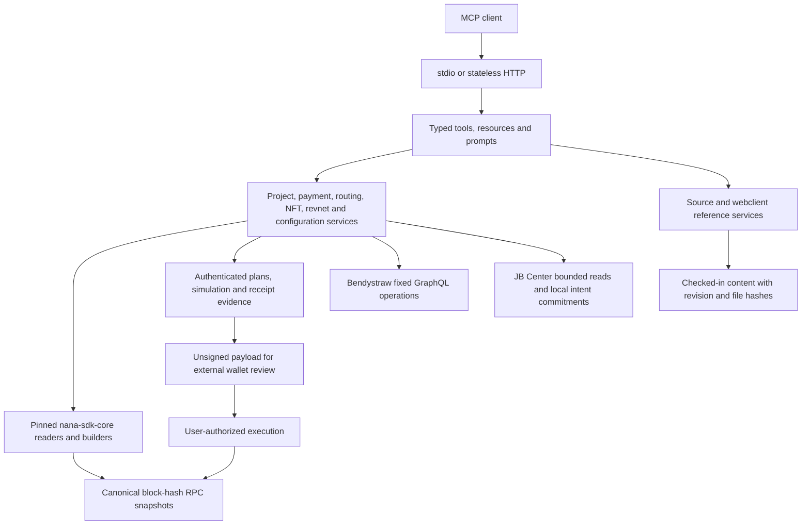

# Architecture

The protocol services are transport-independent. MCP translates validated user intent into service calls; it does not own financial math, private keys, arbitrary RPC access, or an execution queue.

## Dependency rules

`domain` has no transport dependency. `adapters` own network boundaries and runtime response validation. `services` own protocol behavior and produce JSON-safe observations or unsigned `PlanDraft` objects. `mcp` validates/advertises tool inputs and wraps results in a common envelope. `transport` owns connection lifecycle, concurrency, HTTP headers and cancellation.

Tests inject `RpcProvider` or bounded adapter requests. Financial tests exercise the actual pinned SDK/viem encoders and decoded calldata, so expected semantic behavior is checked beyond a mocked builder return value.

## State and authority

Deployment addresses and ABIs come from the pinned SDK. The live directory determines a project's controller and terminals; hooks, clone identity and project relationships are checked where required. Source reference bundles provide explanations and development examples, and carry file-level provenance. They never replace deployed-state reads.

`RpcPool.snapshot` first verifies chain identity and reads a mined block. State queries are then bound to `{blockHash, requireCanonical:true}` using EIP-1898. All nested SDK `eth_call` requests inherit that snapshot, with bounded gas. Gas estimation remains a block-number request, followed by the plan verifier's canonical-hash check. Providers unable to serve the required snapshot fail without a weaker fallback.

Partial observations are explicit `known`/`unknown` values. No failed balance, price, configuration or permission read becomes zero or permission. Indexer state remains a separate observation because GraphQL and RPC do not share a transactionally consistent snapshot. Cross-chain identity is verified per peer; each chain's evidence retains its own block.

## Plans

Services return `PlanDraft` with exact account, calls, decoded arguments, dependencies, block evidence, summary and warnings. `PlanService` normalizes bounded JSON, hashes the content and authenticates an expiring self-contained envelope with HMAC-SHA256. Replicas share `PLAN_SECRET`; no process-local plan store is needed.

Authentication protects server-generated review content from modification. It does not grant permission, prove user approval, encrypt content or ensure a transaction will remain executable. Wallet signatures are the execution authority. Tool replay alone cannot pay twice because this server never broadcasts.

Simulation requires an unexpired plan and exact sender. Earlier prerequisite calls must be confirmed with matching sender, destination, value and calldata. No state overrides are used. Verification separately establishes transaction inclusion and supported operation-specific event evidence. A receipt may confirm a transaction while failing to prove an intended outcome, particularly nested Safe/Relayr execution, hook failures or incomplete cross-chain settlement.

Preparation snapshots also prevent an old matching transaction from being reused as evidence for a new plan. Receipt verification is allowed after plan expiry so historical outcomes remain inspectable. Key rotation invalidates old plan authentication; retain the old deployment/key for historical verification if that continuity is needed, or introduce an explicit versioned keyring before rotation.

## MCP shape

Tools expose narrow typed operations and return `{schemaVersion, observedAt, ok, data|error}` with structured JSON and text compatibility. Validation errors and safe domain failures do not expose upstream credential-bearing URLs. Discovery starts at `jb_list_capabilities`, followed by family-specific operations.

Resources expose the capability catalog, ABI inventory, source summary, and paginated source/webclient pages. Prompts organize project review, contributions, project design and webclient integration. Source discovery and content retrieval are separate to bound context size.

The HTTP transport creates a fresh MCP server and transport per request while sharing stateless application services. It has no session ID store or cross-client protocol state. Stdio creates one server per process and uses stdout solely for MCP messages.

## Extension process

When adding behavior, first identify its owning contract and source tests, then add a typed domain schema and transport-independent service method. Resolve deployment/project identity, represent unknown state explicitly, and test failure boundaries and decoded calldata. Add operation-specific receipt evidence before advertising semantic completion. Finally register the tool in its capability family and regenerate the tool catalog.

Do not register stub tools that promise future functionality. Unsupported execution compositions remain explicit limitations even when their complete source and ABI are available for development.
