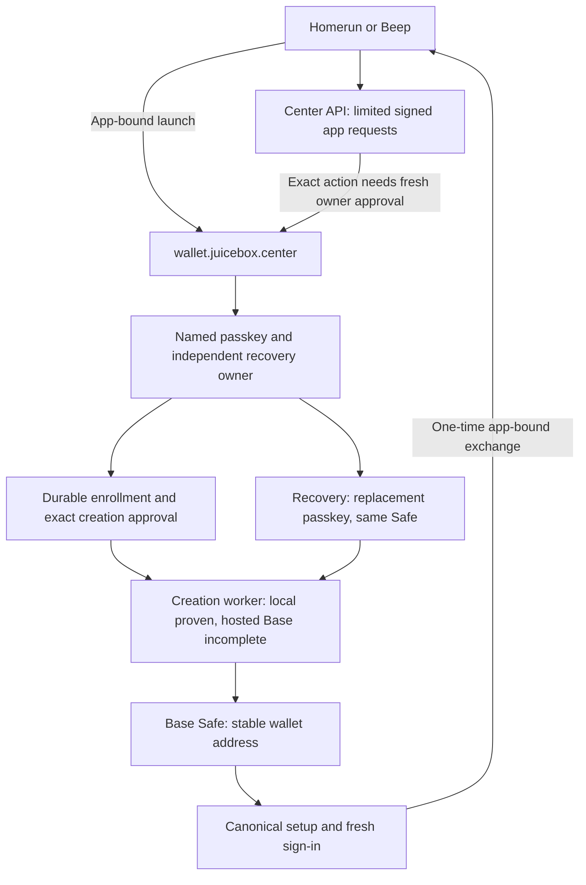

# Shared Center wallets: delivery report

Checkpoint: **2026-09-15 UTC** (September 14 in São Paulo). Application source:
`ac6e48d52fb43d5c90205e9892fff4ccaa011484`. This report consolidates the wallet
project; the [implementation record](CENTER-WALLET-IMPLEMENTATION.md) preserves
the detailed chronology. For continuation, start with the [handoff](CENTER-WALLET-HANDOFF.md).

## Where we stand

**The shared contracts are deployed, signup and recovery work in the local
integration environment, and hosted Base creation is implemented at revision
`516d163` but not configured or funded. Consumer production signup is still
disabled.** Hosted recovery still needs implementation. Passing contract, browser
and PostgreSQL tests does not complete that work; see the
[handoff](CENTER-WALLET-HANDOFF.md) for the completed slice's evidence and the next one.

Homerun showing only external wallets is consistent with this state: its Para
path was removed, and the Center feature remains disabled. People without a
wallet are the intended audience, but cannot yet complete that production journey.
Turning on the client flag now would expose an unavailable service.

| Deliverable | Evidence at this checkpoint | Remaining boundary |
| --- | --- | --- |
| Passkey ownership and account contracts | Real P-256 assertions, pinned Safe stack, contract execution and negative vectors | Complete production journey with real devices |
| Signup without an existing wallet | Browser-generated recovery kit, verified saved-file recovery, local Safe creation and fresh login; hosted Base creation producers and runtime host proven against a Base-shaped local chain | Production configuration, funded treasury, real Dwellir timing |
| Lost-passkey recovery | Local same-Safe owner replacement, old authority revocation, real process-crash recovery | Hosted recovery funding/dispatch and user acceptance |
| Shared app sign-in | App-key-bound launch, one-time exchange, SDK integrated into Homerun and Beep main | Production configuration and joined client acceptance |
| Shared dependencies | Both Relayr payments and all 14 calls finalized across eight chains; all 13 Base runtime checks passed | These deployments do not deploy each user's wallet |
| Base fee accounting | Signed-envelope math, actual receipt verifier, bounded Dwellir observer and local runtime reconstruction | Production fork qualification, admission policy and ledger integration |
| Observability and release discipline | 4,583 checks passed, zero failures/skips; matching GitHub CI succeeded | Hosted failures, actual provider capacity and sustained load |

## The product we are building

One Center wallet follows a person between trusted Juicebox apps. Center uses
the ecosystem origin allowlist; there is no additional per-site consent screen.
Requests and callbacks still bind the exact app, origin, audience and browser key
so a trusted site cannot accidentally receive another app's connection.

The first account profile is a Base Safe with two full owners and threshold one:
an immutable P-256 passkey signer and an independent recovery EOA. A newcomer can
generate that recovery owner in the browser and save a recovery kit. An existing
wallet can serve as the recovery owner instead. Possession of either owner is
powerful: the saved kit is a wallet secret, not an ordinary account identifier.

The client request key receives limited API access. Spending needs a fresh owner
approval for the exact reviewed operation. Login, gas funding, API access and
permission to spend remain separate. There is no automatic asset migration.

Center retains Para alongside passkeys. Juicebox Money and Revnet Money retain
their current integrations. Homerun and Beep are the authorized pilot clients,
with external-wallet support preserved. Passkeys come first; WhatsApp is a
possible later addition. No email/SMS/WhatsApp verification service is required
for the implemented passkey and recovery-kit design.

## What has been built and verified

### Ownership, enrollment and deterministic creation

The account stack combines Safe 1.4.1, Safe7579, EntryPoint 0.7 and the pinned
P-256/FCL signer. The bootstrap creates the signer and Safe with a fixed atomic
initializer. Inspection checks runtime code, creation provenance, owners,
threshold and account configuration against the selected manifest.

WebAuthn validation binds RP, origin, challenge, credential, user handle and
required user presence/verification. Registration produces a candidate; a fresh
possession proof and the independent owner's signature verify the enrollment.
Canonical signature encoding, bounded parsing, separate SafeMessage/SafeOp
preimages and replay protection are exercised by adversarial tests.

PostgreSQL records durable ceremonies, immutable enrollment, nonce and
idempotency claims, app grants, sessions and authority epochs. Exact retries
recover their original result. Missing chain observations remain unknown.

### Signup and recovery, including interruption

The [local signup runbook](../../WALLET_SIGNUP.md) describes the working journey:
name a passkey, generate or connect a recovery owner, save and reopen the correct
kit, approve deployment, complete canonical setup, then sign in freshly.
The recovery phrase stays in browser memory except for the user's explicit
download; it is not put in application storage, URLs, cookies or server requests.
Local-test kits must not be used for real funds.

Signup can advance after the **latest** observation proves canonical creation
and wallet readiness, before treasury finality. This removes the user's finality
wait. The worker still holds its funding lane until finalized settlement, so
this change does not increase creation throughput. A real Anvil rollback rejects
setup, retains the original signed deployment and permits recovery of those
same bytes without creating another wallet.

Recovery imports the original kit or uses the original recovery wallet, proves
the replacement passkey and independent owner, and performs the reviewed signer
creation and owner swap. The wallet address remains unchanged. Activation
supersedes the old credential, revokes old grants and advances session authority.

A joined PostgreSQL/Anvil test kills a child process **after the onboarding
commit and before credential activation**. Fresh service instances resume with
both-owner proof and complete the original setup. The test checks actual
grant/nonce counts, unchanged rotation history, rejected old credentials and
successful new-key login to the same Safe. This proves a specific local crash
boundary; hosted restart and physical-device recovery remain untested.

### App handoff, payment approval and clients

The [handoff protocol](WALLET-HANDOFF-LAUNCH.md) requires a signed launch from the
original app tab before Center issues a code. A secure, HttpOnly launch cookie
and fixed redirects keep proof material out of URLs. Real HTTP, Chromium and
PostgreSQL tests cover copied intent URLs, competing tabs, cancellation and lost
responses. Exchange binds a one-time code, S256 verifier and original app key.

Dedicated payment review binds the exact owner-approved operation. An app or bot
key cannot substitute for the owner's spending signature. Local V6 payment and
UserOperation checks exist; actual hosted provider and complete pilot-client
payment acceptance remain release gates.

Both pilot repositories have the updated SDK and launch integration on remote
main. Their bundled SDK is `juicebox-center-client-db424f6b4338057f.tgz`, SHA256
`db424f6b4338057f1ce6e9db1659cf9d1332f0cc12937cec9b4e8d1fce964b70`.
The feature remains off. Repository revisions and local changes to preserve are
recorded in the handoff.

### Physical passkey tests and the UI feedback they resolved

The test page now allows a memorable passkey name, including **Juicebox test**.
Status text has its own visual treatment instead of resembling a button.
Wrong-credential handling and retry diagnostics were investigated through
observable browser and server events.

| Environment | Recorded result | Limit |
| --- | --- | --- |
| Mac Safari | User confirmed successful registration and fresh possession proof | Authenticator device/provider for each prompt was not recorded |
| Mac Chrome 152 | Visible physical passkey round trip succeeded on September 13 at 22:08:41 UTC | Earlier failure correctly rejected a different stored credential; no virtual authenticator was used for this successful probe |
| iPhone 16 Pro, iOS 26.1, ordinary Safari | Registration at 22:57:11 UTC and possession at 22:58:42 UTC on September 13; user confirmed the chosen name and Success | User taps were required; an earlier intended-key failure was not fully diagnosed; native cancellation was not verified |

These isolated probes created no Center account, wallet, session or payment.
The approved temporary tunnel and helpers were closed. iPad, Android, production
RP, passkey sync and Beep native handoff have not been qualified.

### Shared infrastructure deployed through Relayr

The [deployment record](WALLET-DEPENDENCY-ROLLOUT.md) and its
[public evidence](evidence/wallet-dependency-rollout-2026-09-14.json) retain the
exact funding and destination transactions. Four mainnets and their testnets
are covered: Ethereum/Sepolia, Optimism/OP Sepolia, Base/Base Sepolia and
Arbitrum/Arbitrum Sepolia. Fourteen missing deployments were needed because FCL
was already present on two testnets.

The operator preserves publication claims, exact quote binding, signed bytes,
payment identity and canonical destination evidence across uncertain responses.
Live Relayr responses exposed unordered transaction UUIDs and a disabled-ordering
restriction on `virtual_nonce`; the independent deployment operator now matches
the exact GET echo rather than assuming POST response order.

The dedicated payer spent 0.003484875950828271 ETH on Ethereum and
0.015986827873005615 ETH on Sepolia, including payment gas. Each payment used
nonce zero and one broadcast. Both payments and all destination calls finalized.
Unspent funding remains at that address. Per-user creation/recovery funding is a
separate allocation and has not been prepared or funded.

### Base fees and source evidence

The [Base fee implementation notes](../../src/rest/wallet/stack/baseFees/README.md)
explain the signed-envelope FastLZ calculation and receipt verification. The
verifier checks inclusion identity, the full block hash list and explicit Jovian
L1 attributes. It derives execution, L1 data and operator fees without treating
missing fields as zero. Reverted transactions still pay fees. Its total is
**fees only**, not a claim about the sender's net balance change.

The bounded observer ran through Center's Dwellir archive against two real Base
dependency transactions. Both matched: total fees were 8,677,419,811,957 wei and
10,792,739,476,760 wei. The observations took 3,978 and 2,809 ms and used 28 physical
RPC requests altogether. These are two historical observations, not a latency or
capacity guarantee. See the [recorded results](evidence/wallet-delivery-2026-09-15/base-live-fees.json).

Solidity 0.8.15 locally reproduced the complete observed L1Block implementation,
GasPriceOracle implementation and proxy runtimes byte for byte. No metadata was
stripped or runtime bytes patched. The proxy required an explicit compiler
metadata setting correction. The [evidence bundle](evidence/wallet-delivery-2026-09-15/README.md)
records that adjustment, source/compiler hashes and the durable full archive.
This reconstruction has not received a separate Fable review and is not yet a
production fork/runtime admission policy.

### Observability, audits and bugs caught

The [release observation system](CHECK-OBSERVATIONS.md) captures source revisions
and fingerprints, required suites, bounded child deadlines and redacted logs.
Real PostgreSQL workers, a local EVM, RPC fault proxies and browser tests exercise
lost responses, nonce contention, expiry, reorgs, process death and replay.

Recent behavior regressions exposed an impossible one-unit receipt gas usage,
an incorrect implication about sender balance changes and an RPC structural
limit that rejected otherwise supported full blocks. The fixes have targeted
negative cases. Separate CI fixture fixes wait for worker readiness before
starting short expiry clocks and wait for mined transaction receipts; production
timeouts were not relaxed to make those tests pass.

Claude Fable 5.1 performed model-assisted reviews across contract/dependency,
handoff, recovery, signup and fee scopes. Review findings and closure evidence are
retained. These are not third-party audit certifications or a blanket approval
of the eventual production service. The last fee review identified the block
limit mismatch; its final correction received local regression/full-gate checks
after that review, not a further Fable review.

The latest application revision passed **4,583 checks, zero failed or skipped**
on clean, unchanged source. [The retained report](evidence/wallet-delivery-2026-09-15/release.json)
contains the suite counts and fingerprint;
[GitHub CI also succeeded](https://github.com/mejango/jbcenter/actions/runs/34921022953).
This documentation checkpoint does not claim a new application release test.

## The remaining path to production testing

1. **Implement hosted Base creation and recovery.** Reuse the durable local
   boundaries, qualify fee runtimes/forks, define explicit funding policy, retain
   signed bytes before sending, and join complete fees to settlement. The actual
   server entrypoint currently supplies no wallet configuration.
2. **Close treasury and availability gaps.** A Base type-2 fee cap does not cap
   future L1/operator charges. Preserve actual debit and unresolved liabilities,
   including any cost above a reservation. Add restore provenance outside the
   database's own rollback domain. Resolve the finality-held single-lane
   bottleneck with an explicitly reviewed bounded design.
3. **Complete hosted signup, recovery and client payment acceptance.** Exercise
   restart, uncertain response, cancellation, retry, rollback and revocation.
   Fix the ordinary application Relayr quote mapping before activating that
   payment path; the independent deployment operator's fix is not applied there.
4. **Qualify pressure and real devices.** Current tests do not establish 10,000
   active-wallet capacity, provider quotas or the sustained/burst/soak targets.
   Test the actual production RP on Mac, iPhone and iPad, and Beep's app handoff.
5. **Enable the pilot after the path works.** Configure Center and client builds,
   make Homerun's Sign in welcoming to people without a wallet, verify existing
   external-wallet access, and observe a complete production round trip.

The next user checkpoint is a concrete runtime funding address and budget when
the reviewed adapter is ready, followed by device prompts on the real hosted
journey. No further DNS work is currently outstanding. There is no reliable
launch ETA yet; the remaining work is substantive implementation, not a flag flip.
