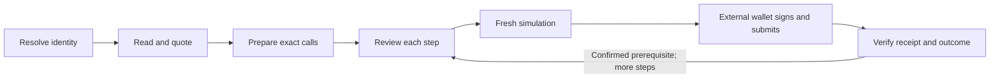

# User journeys

The Juicebox MCP helps people understand projects, contribute, publish reviewed project metadata, operate treasuries and shops, manage revnet positions, reconcile cross-chain activity, and build applications. Its 56 V6-only tools across ten capability families combine into the 26 journeys below. The [tool catalog](TOOLS.md) supplies exact API descriptions and schemas; this guide explains the user goals, sequence of work, and expected outcomes.

These journeys describe the implemented V6 service. A natural-language request is a starting point for an assistant, not a complete transaction instruction: the assistant still needs the user's intended project, chain, account, asset, amount, beneficiary, and terms where relevant.

Connect any compatible Streamable HTTP MCP client to
`https://juicebox.center/mcp`. MCP tools do not require a Center REST account,
bot grant, smart wallet, or weekly/monthly session. Start with the user's actual
task and collect only its missing inputs; do not run the entire discovery
catalog before every request. For a known V6 project, go directly to the relevant
read or quote. Resolve names or ambiguous versions first.

The [Center journey map](../../docs/rest/USER_JOURNEYS.md) covers the directory,
REST, sponsored execution, and shared IPFS/RPC services. REST plans and MCP plan
tokens are separate; passing an MCP token to a REST submission route is not a
supported handoff. Prepare a REST plan through its own API when using Center's
relay. Hosted sponsored owner execution is configured on four mainnets, but
live wallet-signed execution still requires its own validation; this MCP guide
does not certify that journey.

## Choose a journey

| Person                            | Goals                                                                                                   |
| --------------------------------- | ------------------------------------------------------------------------------------------------------- |
| Explorer or analyst               | [Understand a project, reconcile holdings, and investigate activity](#explore-projects-and-accounts)    |
| Contributor or collector          | [Contribute, purchase NFT tiers, and cash out](#contribute-collect-and-cash-out)                        |
| Creator                           | [Model economics, pin reviewed metadata, and launch a core or NFT project](#design-and-launch-projects) |
| Project operator                  | [Queue rulesets, distribute payouts, manage routing, and maintain tiers](#operate-a-project)            |
| Revnet founder or participant     | [Understand stages, deploy a revnet, claim auto-issuance, borrow, and repay](#use-and-create-revnets)   |
| Omnichain participant             | [Discover peer projects, claim bridged balances, and synchronize accounting](#follow-omnichain-state)   |
| Anyone reviewing execution        | [Inspect deployment intents and reconcile transaction plans](#review-intents-and-transactions)          |
| Application or protocol developer | [Build webclients and investigate contracts using cited source](#build-with-the-protocol)               |

Start with `jb_list_capabilities` when the assistant needs to discover supported operations. An MCP client can also request the `inspect-project`, `review-contribution`, `design-project`, or `build-webclient` prompt, supplying a `request` string. Prompts guide the assistant's work; they do not execute a journey automatically.

## What carries across every journey

**Identity and evidence.** Every operational journey is V6-only. Projects are identified by version, chain, and project ID. Use explicit V6 identifiers or the resolver; a versionless SDK identifier defaults to V4 and must not be used as a fallback. Names return V6 candidates for selection; parsing an identifier does not prove the project exists. Consequential reads carry block evidence. Indexed records, project-authored descriptions, source references, and live contract state retain their different authority and coverage.

**Amounts and rights.** Tool arguments use exact integer strings for asset amounts and uint256 identifiers. The assistant translates human amounts using the correct asset decimals and keeps accounting currency separate from token address. An operator permission is scoped to its account, project, and operation. An unavailable read cannot establish either a zero balance or permission to act.

**Transaction handoff.** Transaction-preparation tools return an authenticated unsigned plan and the first step's preflight result. Review the actual result: returning a plan alone does not establish that its preflight succeeded. `jb_prepare_intent` returns a Center commitment/signing message. `jb_prepare_project_metadata` returns an exact JSON review and publication token. Neither is a transaction plan or user approval.



The shared [transaction review journey](#reconcile-a-prepared-transaction) applies to every transaction below. The MCP does not hold wallet keys, sign, broadcast, or publish Center intents. A client or external wallet performs those actions after the user approves the exact operation. The integrated service can publish new project metadata through the separate [explicit public-upload review](#review-and-pin-new-project-metadata); pinning does not execute a transaction. A supported semantic outcome, such as NFT delivery, requires more evidence than a successful outer transaction receipt.

**Availability.** The following prerequisites determine which parts can run:

| Work                                                                                                                                               | Required access                                                                           |
| -------------------------------------------------------------------------------------------------------------------------------------------------- | ----------------------------------------------------------------------------------------- |
| Capability discovery, source/ABI lookup, webclient integration plans, hypothetical economics, local intent-message and metadata review preparation | Installed service and its bundled references; no upstream request needed                  |
| Live project, permission, hook, position, loan, quote, transaction preparation, and receipt checks                                                 | Configured RPC supporting the adapter's canonical block-hash reads                        |
| Named-project and account discovery, indexed activity, indexer status, indexed omnichain groups                                                    | Configured Bendystraw endpoint for the selected network                                   |
| Center intent listings and signature-verified intent reads                                                                                         | Integrated Center store callbacks, or approved standalone API access                      |
| Publication of exact reviewed new standard project metadata                                                                                        | Integrated Center pinning backend, available quotas/providers, and explicit user approval |
| Signing, submission, image/media publication, proof acquisition, and application implementation                                                    | External wallet, client, developer environment, or appropriate integration                |

Search reports each upstream separately. A Center outage need not erase available deployed-project results, and unavailable indexed metadata need not erase a successful on-chain project read. Center search filters out other deployment versions and preserves the upstream cursor; an empty filtered page can still have a next page. When the upstream count includes other versions, the V6 total remains unknown. Mainnet and testnet indexers require separate configuration. See [deployment configuration](DEPLOYMENT.md) for setup.

## Explore projects and accounts

### Find and understand a project

> “What does this project do with contributions, and who can change its terms?”

Use `jb_resolve_project` for an explicit identifier or supported project URL, or `jb_search_projects` for discovery. Select a candidate before calling `jb_get_project`, `jb_get_rulesets`, and `jb_get_routing`. For a specific proposed operator action, use `jb_get_permissions` with the relevant account and permission IDs.

The result is an explanation of ownership, current and queued economic rules, issuance and reserved tokens, payout access, surplus, and the actual hook/terminal composition. It should identify unknown accounting or custom behavior. Upcoming terms and approval status do not promise when a future configuration will execute. Center listings are restricted to V6 but still require chain selection and signature verification through the intent journey below.

### Reconcile an account's holdings

> “Which Juicebox positions does this address have, and what does it hold in this project now?”

Page through `jb_get_account` to discover indexed participant positions, then use `jb_get_position` and `jb_get_project` for each selected project. The live position distinguishes ERC-20 tokens from unclaimed project credits. Inspect a known loan separately with `jb_get_loan`.

This produces scoped holdings with exact units and freshness. It is not exhaustive NFT or loan enumeration, a complete wallet net worth calculation, or a current USD portfolio valuation. A known project can be inspected directly even when indexed account discovery is unavailable.

### Investigate activity and accounting differences

> “Why does the activity feed show incoming funds that are not all available for payout?”

Combine paginated `jb_get_activity`, `jb_get_indexer_status`, `jb_get_project`, and `jb_get_rulesets`. Trace the relevant event types and transaction hashes, compare indexed progress with live evidence, and explain payout limits, spent limits, splits, fees, and surplus in their actual contexts.

The outcome is an evidence-based explanation of the available observations. Activity pages are not complete transaction traces. Indexed `balanceUsd` represents historical flow accounting; it cannot establish current market value or spendable funds. A separate indexer-status request does not pin the activity page to a block.

## Contribute, collect, and cash out

### Review and make a contribution

> “Explain what contributing this amount would do before I sign.”

Inspect the project and its routing, establish the actual payer and beneficiary, then call `jb_quote_pay`. Explain how the supported route allocates funds between treasury funding and market acquisition, how beneficiary and reserved token outputs differ, and which outputs are protected. Use `jb_prepare_pay` when the intended payment is established, then follow the shared review/simulation/wallet/verification flow.

A successful journey produces verified payment evidence for the selected route. ERC-20 funding can require separate allowance steps. The quote does not prove an unqueried route is better or worse; unsupported partial buyback execution and custom compositions are reported explicitly.

### Purchase NFT tiers while supporting a project

> “Show the available tiers, price this cart, and verify that the NFTs arrive.”

Use `jb_get_721_shop` to identify the canonical hook, pricing context, flags, and paginated tiers. Select tier IDs and quantities, then use `jb_quote_721_pay` and `jb_prepare_721_pay`. Represent quantities by repeating IDs in `tierIds`, with at most 32 entries. Review the route's actual payer/credit context, cart metadata, funding prerequisites, and output protections. Receipt verification checks NFT delivery separately from the fungible payment.

Inventory belongs to the selected chain. Reserves affect paid availability, so `remainingSupply` is not itself a promise that every remaining token can be purchased. Discounts use denominator 200. URI resolution can be requested from the contract, but the MCP does not fetch media or treat metadata as instructions. Positive NFT-tier split forwarding is outside the supported payment adapter.

### Cash out project tokens

> “What would I receive for cashing out this token amount?”

Read the holder's live position, project state, and relevant routing; then call `jb_quote_cash_out` with the reclaim asset and beneficiary. Explain surplus, the applicable cash-out curve, fees, and net proceeds. `jb_prepare_cash_out` preserves the route's terminal minimum and hook metadata together in the exact unsigned call.

Completion requires matching cash-out evidence after wallet execution. Treasury balance alone does not determine the reclaim amount. Cash-out restrictions, insufficient liquidity, and unsupported hooks can prevent preparation; another project's cash-out assumptions cannot be reused as this project's quote.

## Design and launch projects

### Compare proposed economics

> “How would these issuance, reserved-token, decay, and cash-out terms behave?”

Use source references to establish the intended configuration, then call `jb_model_economics` with explicit scenarios. Specify whether a ruleset is initial or a successor, the contribution value already expressed in base currency at 18 decimals, completed cycles, and any independent hypothetical cash-out inputs.

The output is a reproducible comparison using exact integer arithmetic and contract rounding. Successor weight `1` needs an explicit inherited weight; duration zero has no automatic cycles. The core model rejects enabled data hooks whose economics it cannot represent. It does not forecast demand, convert arbitrary assets, or establish an executable quote. The assistant still needs the user's choice before preparing a launch.

### Review and pin new project metadata

> “I have the project's name and description. Help me publish the metadata and use its IPFS URI in my V6 launch.”

Call `jb_prepare_project_metadata` with `version: 6` and the complete new metadata document. `name` and `description` are required; `logoUri` and `infoUri` are optional. Start without a logo if it is not already hosted. A real canonical IPFS CID or absolute HTTPS URL is required for a supplied URI; `ipfs://<IMAGE_CID>` and local file paths are rejected.

```json
{
  "version": 6,
  "metadata": {
    "name": "Example project",
    "description": "What the project is raising funds to do."
  }
}
```

Show the user the returned `review.metadata` and exact canonical `review.jsonText`, its SHA256, UTF-8 size, and review expiry. Explain that publication is public and may be permanent. Preparation performs no upload. Only after the user explicitly approves that exact public document, call `jb_pin_project_metadata` with the unmodified review token and `confirmPublicUpload: true`. The token authenticates the review and expires after ten minutes by default; it does not establish approval. Edited content or an expired token requires a new review.

The integrated Center backend pins the exact canonical JSON bytes and returns `metadataUri`, the CID, content SHA256, and primary-upload/queued-redundancy status. Use the URI as `projectUri` in `jb_prepare_launch` or `jb_prepare_721_launch`, or as `config.description.uri` in `jb_prepare_revnet_deploy`. Finish the selected launch's complete typed inputs and separate transaction review. Pinning needs no wallet and has not launched or changed a project.

This journey handles a new standard document of at most 64 KiB of canonical UTF-8 JSON. It does not fetch or upload images, check linked-content availability, preserve custom fields from existing metadata, merge an existing document, or prepare an existing-project URI update. In a standalone server without the pinning callback, preparation explains the missing backend; prepare the same document through `https://juicebox.center/mcp` before seeking approval there. Tokens are not assumed portable between servers. A `METADATA_PUBLICATION_UNVERIFIED` result means content may already be public; inspect backend status before deliberately retrying. A queued redundancy receipt does not prove content was fetched back or that every replica is available.

### Launch a core project

> “Prepare a project with these economic terms, recipients, and accepted assets.”

Establish the owner, chain, complete rulesets, split groups, fund-access limits, terminal accounting contexts, and metadata URI. Use `jb_prepare_launch` with the explicit `core` composition. The tool checks the live per-chain creation fee and constructs the reviewed launch call.

The wallet executes the plan; verification derives the deployed project identity from matching launch evidence. Obtain a metadata URI through the [reviewed metadata journey](#review-and-pin-new-project-metadata) or an existing publication integration before preparation. This journey creates a core project; use the separate NFT or revnet launch journey for those compositions. There is no generic atomic multi-chain core launch tool.

### Launch a project with an NFT shop

> “Launch these project terms with a tiered NFT collection attached from the start.”

Use `jb_prepare_721_launch` with complete rulesets, tiers, pricing, and accepted terminal contexts. The supported factory wires the canonical 721 hook and metadata fields. Review creation fees, pricing-feed availability, reserves, tier categories, and immutable or restrictive flags before signing.

After launch verification, use `jb_get_project` and `jb_get_721_shop` on the returned identity to inspect the result. Collection media and tier-specific content creation/publication happen outside the MCP; the project-level metadata URI can come from the reviewed metadata journey. Attaching an NFT configuration to an ordinary core-launch argument is not an equivalent supported path.

## Operate a project

### Review and queue a ruleset change

> “Change next cycle's terms without losing existing splits or overriding locked commitments.”

Read `jb_get_rulesets` and the project's current state. Use `jb_preview_ruleset_change` to compare a complete proposed configuration against live terms, permissions, splits, limits, locks, and queue state. Resolve the diff, then use `jb_prepare_ruleset_change` and the shared execution flow.

The immediate outcome is a verified queue operation. Follow-up reads establish whether the configuration is upcoming, approved, active, or failed; an approval hook can make timing conditional. Omitted settings are not interpreted as “keep everything else unchanged,” and a preview is not a guarantee of future activation.

### Distribute a project's payout

> “How much of this payout can the project currently distribute?”

Inspect live terminal balances, currency contexts, payout budgets, used limits, and splits with `jb_get_project`. Use `jb_quote_payout` as the actual caller, review the amount currently payable, then prepare with `jb_prepare_payout`.

The protected minimum concerns the recorded payout amount; it does not guarantee every recipient receives funds. A recipient transfer or hook can fail and return funds while consuming payout limit. Review recipient-level evidence and the verification outcome before calling distribution complete. This journey is payout distribution through configured splits, not an arbitrary transfer from the project treasury.

### Maintain buyback pools and oracle settings

> “Why is buyback unavailable, and can the operator update its pool or TWAP window?”

Start with `jb_get_routing` to inspect the effective hook, pool identity, liquidity, oracle observations, and requested window. Depending on the intended change, use `jb_prepare_buyback_pool`, `jb_prepare_buyback_twap`, or `jb_prepare_buyback_hook`. Each preparation checks relevant live authority and supported implementation assumptions.

Pool registration selects an existing pool; it does not create a pool or supply liquidity. A configured pool can still lack useful liquidity or oracle history. Changing a registry override can expose a cohort fallback, including an unavailable or zero fallback. Current V6 has no `setDefaultSlippageToleranceOf` operation: transaction minima and the contract's derived tolerance have different roles.

### Change a project's routing terminal

> “Inspect this project's current router, then prepare the intended override.”

Use `jb_get_routing` to distinguish directory terminals, the router registry, the effective project selection, and the cohort default. `jb_prepare_router_terminal` prepares the authorized registry change with the explicit implementation address. Verify the transaction, then read routing again.

Clearing an override restores its actual fallback behavior; it does not necessarily disable routing. An empty routing-terminal accounting-context list does not mean no routed tokens are accepted. Registry selection or pool discovery alone does not establish that a proposed swap or payment is executable.

### Add or remove NFT tiers

> “Prepare new tiers and retire these removable tiers.”

Read `jb_get_721_shop`, inspect relevant rights, and use `jb_prepare_adjust_tiers` with explicit additions and removal IDs. Review price, category, supply, votes, reserves, discount, split settings, and flags. After verifying the transaction, re-read the shop's relevant pages.

This journey supports additions and removals with contract constraints. It does not expose every NFT administration method, such as arbitrary edits to an existing tier, owner minting, transfer operations, discount setters, or metadata setters. Source and ABI references remain available for implementing those distinct workflows.

## Use and create revnets

### Understand stages and claim auto-issuance

> “What stage is this revnet in, and can this beneficiary receive its scheduled issuance?”

Use `jb_get_revnet` to verify revnet identity and inspect the configuration commitment, original stage records, current rules, cash-out delay, loans contract, and NFT hook. Supply an operator candidate when checking that predicate. For a known stage and beneficiary, use `jb_prepare_auto_issue`, then verify the resulting mint.

The stage ID is the deployment ruleset ID, not an array index or start timestamp. The contract does not enumerate every auto-issuance beneficiary or expose an enumerable current-operator getter. Unknown operator or schedule discovery remains explicit. Stage economics and changeable split recipients have different control rules.

### Deploy a revnet

> “Prepare these committed stages, accepted currencies, extensions, and recipients for deployment.”

Use `jb_prepare_revnet_deploy` with complete typed configuration, accounting contexts, stage terms, auto-issuance rows, and the intended sucker/721/Croptop settings. Review fees, feed availability, absolute start times, salt choices, and any per-chain configuration before external execution.

Each request prepares one chain. A multi-chain rollout repeats the required immutable configuration, salts, absolute stage times, sender, and all chains' auto-issuance rows consistently; project IDs can differ by chain. Local sucker deployment does not prove the remote project is ready. The current deployer overload creates a default NFT store when tiered configuration is omitted, and a non-ETH base requires explicit NFT pricing configuration. Existing-project revnet migration is outside this preparation path.

### Compare a loan with cashing out and prepare borrowing

> “What collateral would this loan use, what debt would I owe, and what would reach my wallet?”

Inspect the revnet and holder position, then use `jb_quote_loan` with the intended collateral, source asset, beneficiary, and prepaid fee choice. A separate `jb_quote_cash_out` can explain the alternative using its own assumptions. Review gross debt, economic capacity, available liquidity in the chosen source token, fees, and liquid-proceeds bounds before `jb_prepare_borrow`.

The borrow minimum protects **gross debt before fees**, not a guaranteed amount of liquid proceeds. Conditional fee routing can produce a proceeds range. Borrowing authority and REVLoans' permission to burn the holder's project tokens are separate checks. When the submitting account is the holder, the plan can include an explicitly reviewed missing `BURN_TOKENS` grant preserving existing permissions. A delegated borrower needs the holder to establish that grant first. Verify loan-opening and transfer evidence, not just the prerequisite grant.

### Inspect and repay a loan

> “What is owed on this loan, and how much collateral can this repayment return?”

Use `jb_get_loan` with its chain and loan ID to inspect the current NFT owner, collateral, asset, fees, and deadline. Call `jb_prepare_repay` with the desired collateral return and bounded spend. Review the current owner's or permitted operator's authority, repayment funding, and native/ERC-20 prerequisites before execution.

Verify the repayment and collateral outcome, then inspect any replacement loan. Partial repayment can create a new loan ID retaining the original deadline. Partial-repayment quoting during a cash-out delay is explicitly unsupported by this adapter; a full repayment can still be prepared when otherwise eligible. Reallocation into greater debt is a separate workflow, not a hidden consequence accepted by this repayment planner.

## Follow omnichain state

### Discover and validate connected projects

> “Which projects belong to this cross-chain group, and how are they connected?”

Use `jb_get_omnichain_group` for indexed discovery, then `jb_get_bridges` for live registry membership, reciprocal peers, transport, remote project IDs, and accounting observations. A movement scan requires an explicit bounded block range.

The output is a scoped connection map with independent evidence on each chain. Project IDs need not match across chains. Indexed grouping alone is insufficient for preparing a claim, and there is no atomic global state snapshot or promise that all accounting messages have arrived.

### Claim an eligible bridged balance

> “Verify this destination claim proof and prepare the claim for its beneficiary.”

Obtain the leaf and depth-32 Merkle proof through the external client or appropriate integration. Use `jb_get_bridges` to establish the destination context, then `jb_prepare_bridge_claim` with the supplied proof, token, and beneficiary. The tool verifies the registered sucker, checks that the submitting account matches the beneficiary, and simulates current claimability against accepted roots.

Completion is verified destination claim evidence. The MCP does not acquire the proof or initiate a generic holder-token bridge transfer. A confirmed source transaction does not establish that a destination proof is ready; root delivery, claim status, and destination execution remain separate observations.

### Send an accounting synchronization message

> “Prepare an accounting update for this sucker using this maximum native transport budget.”

Inspect live bridge/accounting state, then use `jb_prepare_accounting_sync` with an explicit bounded transport budget. Review supported transport requirements and remember that wallet gas is additional. Verify the local synchronization/send evidence after submission.

This permissionless operation synchronizes accounting. It does not move or claim the holder's project tokens, and source confirmation does not establish remote delivery. Re-read destination observations when evaluating whether accounting caught up; there is no generic destination-delivery watcher in this journey.

## Review intents and transactions

### Inspect or prepare a deployment intent

> “What launch has this publisher committed to, and can I prepare a commitment for my reviewed launch?”

Use `jb_search_projects` to discover undeployed Center listings, inspect each listing's deployment version and chain IDs, and use `jb_get_intent` to validate a selected V6 envelope's commitment and publisher signature. Listings alone are not per-item signature verification. Decode relevant calls with `jb_decode_calldata` and inspect their contract source and live destinations as needed.

For a new intent, first obtain the reviewed deployment calls through the appropriate supported launch journey. `jb_prepare_intent` produces the exact local Center commitment and signing message for those calls and the `.jb` document. External clients handle signing, publication, and later deployment reconciliation. The commitment does not validate arbitrary call economics, prove publisher control of a project, include wallet approval, or replace the full transaction plan's native value and prerequisites.

### Reconcile a prepared transaction

> “Was the transaction I submitted the one we reviewed, and did the intended operation happen?”

Retain the plan token and each submitted hash with its zero-based step index. `jb_inspect_plan` authenticates the reviewed calls. Before signing a step, use `jb_simulate_plan`; provide matching confirmed prerequisite hashes in `confirmedTransactions` for dependent steps. The wallet signs and submits the exact account, chain, destination, calldata, and native value. Use `jb_verify_plan` with the indexed hashes afterward.

The result separates transaction confirmation from supported semantic outcome verification. Pending, reverted, mismatched, partial, and unverified outcomes need different handling. Do not submit a dependent payment merely because its allowance step simulated: its real prerequisite must confirm. Changes to account, chain, terms, quote assumptions, or plan expiry require renewed preparation and review. Expired plans remain available for authenticated historical inspection and receipt verification while the server retains the plan-authentication secret.

Direct receipt verification supports ordinary externally owned account transactions. Safe/Relayr wrappers and smart-account execution, including delegated sender code, need their own inner-call proof integration; a successful outer receipt is insufficient here. The development references help implement those client flows without claiming the direct verifier already handles them.

## Build with the protocol

### Build a webclient feature or an application

> “Plan a React revnet app with payments, a shop, loans, and cross-chain claim status.”

Call `jb_list_webclient_references` to discover features, then `jb_plan_integration` with `react` or `vanilla`, the project type, chain scope, and requested features. Retrieve relevant implementation and test pages using `jb_get_webclient_reference`. Plans order dependencies and identify reads, exact SDK imports/builders, review steps, and outcome checks.

| Application goal                  | Feature selection to start with                              | Useful reference emphasis                                               |
| --------------------------------- | ------------------------------------------------------------ | ----------------------------------------------------------------------- |
| Discovery and account dashboard   | `indexed-queries`, `account-portfolio`                       | Juicescan account UI and the two React clients' data and holdings code  |
| Contribution and exit UI          | `payments`, `cashouts`, `buyback-routing`, `router-terminal` | Actual payer/route selection, SDK builders, output protection, receipts |
| NFT storefront and administration | `721-storefront`, `ruleset-editing`                          | Juicescan tier builders and Juicebox Money/Revnet Money shop flows      |
| Creator launch interface          | `project-launch`, `metadata-center`                          | Launch validation, publication integrations, review, deployed identity  |
| Revnet application                | `revnet-launch`, `revnet-stages`, `revnet-loans`             | Revnet Money stages and loans, launch builders, immutable terms         |
| Cross-chain completion UI         | `omnichain-claims`, `review-pipeline`                        | Proof/status handling, prerequisites, Safe/Relayr source examples       |

For example, these are valid arguments to `jb_plan_integration`:

```json
{
  "framework": "react",
  "projectType": "revnet",
  "chainIds": [1, 8453],
  "features": ["payments", "721-storefront", "revnet-loans", "omnichain-claims"]
}
```

The service adds required dependencies, including the transaction review pipeline. React plans prioritize Juicebox Money and Revnet Money; vanilla plans prioritize Juicescan, while retaining relevant shared SDK examples. The developer adapts provider/state dependencies, implements the app, and runs its tests in their own environment. The MCP returns a source-backed implementation plan, not generated application files or a deployed site. Its code references include metadata publishing, Safe, Permit2, and Relayr integration details that are broader than its direct execution tools. See [WEBCLIENTS.md](WEBCLIENTS.md) for all 15 features.

### Investigate protocol behavior or implement an additional adapter

> “Show the contract behavior, SDK entry points, and existing client tests behind this feature.”

Use `jb_list_references` and `jb_search_reference` to find contract, SDK, Bendystraw, Center, and Juice skill material. Read exact pages with `jb_get_reference`, inspect a named ABI and SDK deployment address with `jb_get_contract`, and use `jb_decode_calldata` when examining encoded calls. Cross-reference application tests through the webclient tools.

The result is a cited explanation or implementation specification with repository revision, exact file hash, line provenance, and dirty-source flags. Source search is bounded lexical retrieval; follow pagination and narrower queries when needed. A bundled ABI is not proof of the current project's selected contract, a source revision is not deployed-bytecode verification, and source access does not expose an arbitrary contract-write tool. A developer implements and tests any new adapter before it becomes operational MCP coverage.

## Using this guide to check completeness

For a proposed experience, identify its journey, required user inputs, upstream prerequisites, and evidence needed at completion. Follow the returned pagination and keep unknowns visible. Use the generated [tool schemas](../data/mcp-tool-catalog.json) for actual calls and the [verification record](VERIFICATION.md) for what has been tested.

The supported journeys compose into larger experiences, but each retains its own boundary. A launch can be followed by shop administration and a contribution; a verified source message can be followed by destination discovery and a supplied-proof claim; a development plan can combine every supported feature. Combining them does not turn separate chains into an atomic operation, a source example into an installed app, or an unsigned plan into permission to execute.
